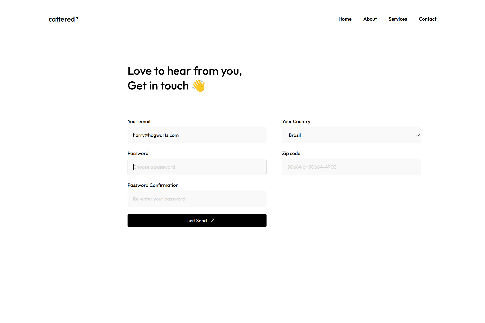

# Form Validation ✅

  

<h2 align="center">
  <a href="https://nightrunner4.github.io/form-validation-with-js">👉 Demo</a>
</h2>

### About 📖

Assignment of the JavaScript chapter in [The Odin Project](https://www.theodinproject.com). Practice of form validation exclusively using JS & Constraint Validation API

### Resources Used 📚

- [Dribbble - Raafi G]() (UI Inspo)
- [Google Fonts](https://fonts.google.com) (Icons & Font)
- [EmojiTerra](https://emojiterra.com/) (Emojis)

### Built With 🛠️

- JS
- CSS
- HTML
